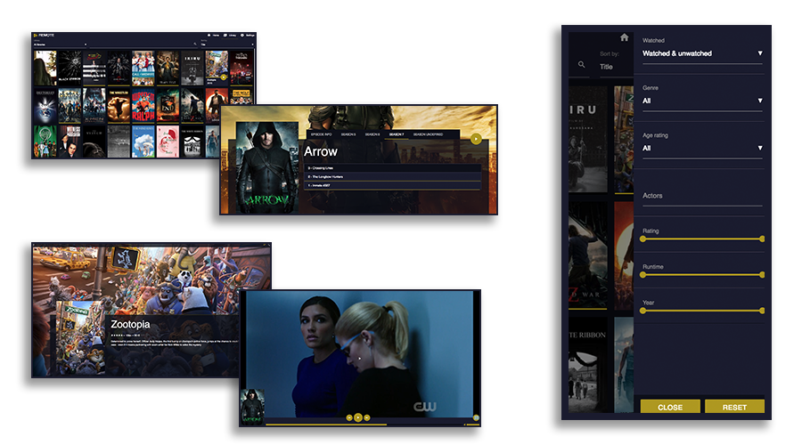
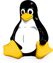
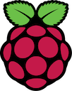

[](https://gitter.im/remote-mediaserver/Lobby)
[](https://discord.gg/4H5EMd6)
[](https://travis-ci.org/OwenRay/Remote-MediaServer)
[](https://www.npmjs.com/package/remote-mediaserver)




# INSTALL
### OPTION 1, INSTALL PRECOMPILED   
Download and unzip the version appropriate to your os.

Linux | Windows | MacOS | Raspberry PI
--- | --- | --- | ---
[](https://s3-eu-west-1.amazonaws.com/remote-mediaserver/dev/linux.zip) | [](https://s3-eu-west-1.amazonaws.com/remote-mediaserver/dev/win.zip) | [](https://s3-eu-west-1.amazonaws.com/remote-mediaserver/dev/osx.zip) | [](https://s3-eu-west-1.amazonaws.com/remote-mediaserver/dev/arm.zip)   

### OPTION 2, INSTALL VIA NPM
You'll need:
- NPM  
- NodeJS >= 10 

To install run:   
`$ npm install -g remote-mediaserver`

after installation you can run RMS:  
`$ remote`  
direct your browser to http://localhost:8234

# DEVELOPMENT
### Installing dependencies
To setup your development environment run the following commands
```bash
npm install
npm install --prefix frontend && npm run build --prefix frontend
```  
  
To start the server:  
`$ node main.js`  
  
A settings file (~/.remote/settings.json) will be created at first run  
Restart the server after direct modification  
  
direct your browser to http://localhost:8234
  
### Frontend
The frontend is build on [React](reactjs.org/)   
to build and test the frontend first make sure the backend is running  
then execute the following:  
`$ cd frontend`  
`$ npm start`  
  
The webapplication will now be accessible from http://localhost:3000
